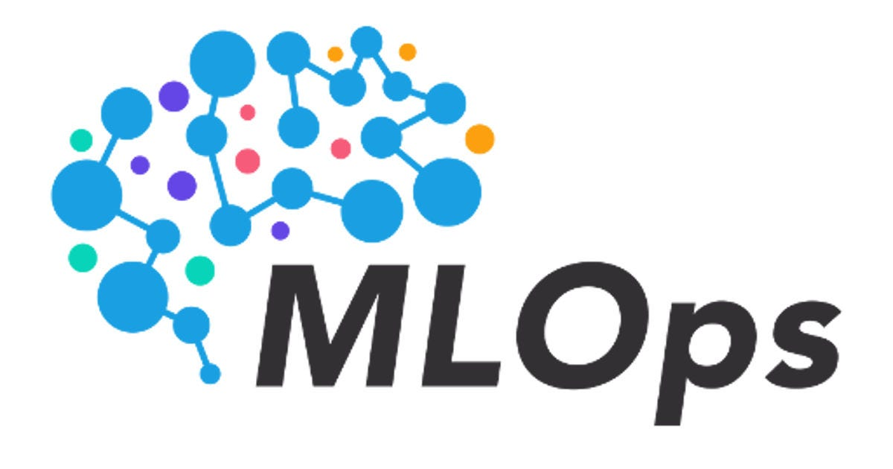

# Machine Learning Operation - MLOps

MLOps, short for Machine Learning Operations, is a set of practices and tools that aim to streamline and automate the deployment, management, and monitoring of machine learning models in production environments. It combines principles from machine learning, software engineering, and operations to ensure the efficient and reliable operation of machine learning systems.

The goal of MLOps is to bridge the gap between data science teams, who develop and train machine learning models, and IT operations teams, who are responsible for deploying and maintaining applications in production. By integrating machine learning workflows into the overall software development and operations lifecycle, MLOps helps organizations scale and operationalize their machine learning initiatives.

## Why is MLOps important?

- Efficient model deployment
- Scalability and reliability
- Reproducibility and version control
  - Continuous integration and deployment
- Monitoring and observability
- Collaboration and governance
- Reduces overall cost

## Labs

In this project, we will collect a series of lab excercises with the aim to help us understand the MLOps concept and how they apply to a real use case.

- Discovery